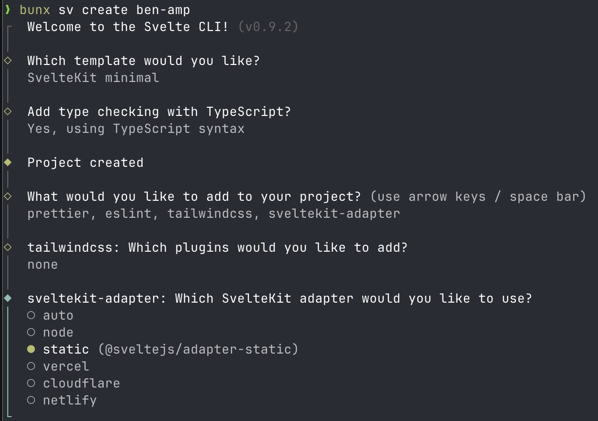

## Purpose

my job restricts me from running vlc or cog ....

static site web app @ player.mitchinson.dev

## Requirements

- plays back music from the local filesystem.
    - ✅ here are no file uploads to any server.
    - ✅ browser apis are used to load data from filesystem.
- shows album art
- ✅ track progress bar
- show next up track
- I'm realizing that [leerob vercel music app](https://github.com/leerob/next-music-player) has a lot of this already
  - whatever i wanna make my own, i'll steal some of those feature requirements tho
    - Uses MediaSession API to sync track metadata with system controls
    - Press space to play/pause from anywhere in the app

vibe code generated using claude sonnet 4 with zed, after this template init:

## Future Ideas

- ✅ Sort by track length, useful to cut out 0:03 tracks from OSTs
- Folder specific theming
